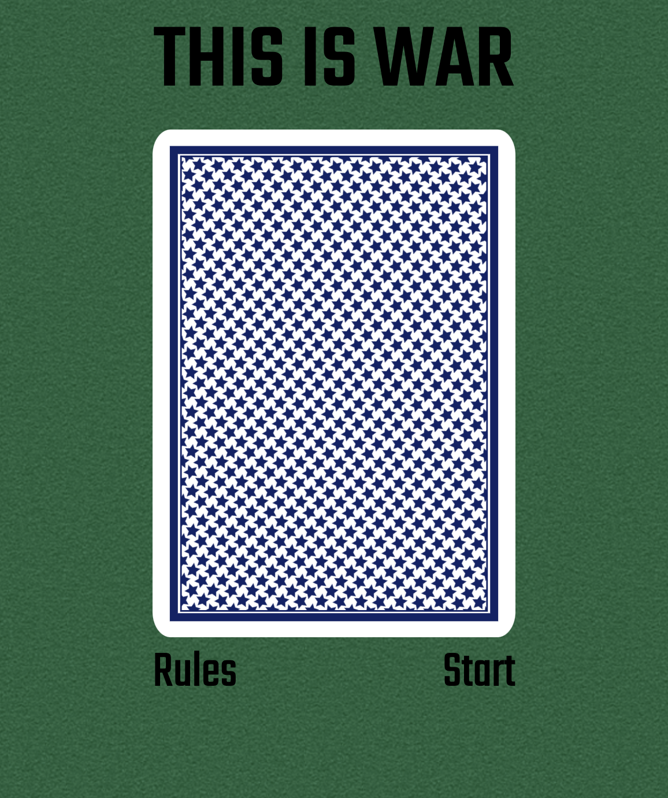
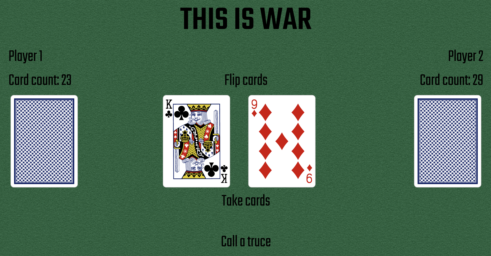

# War Card Game
War is a card game in which the objective is to obtain all 52 cards in the deck.

## Technologies Used:
* HTML
* CSS
* Javascript/jQuery
## Getting Started
[Click here to launch game](https://kstick9210.github.io/War-Card-Game/)
## Next Steps
* Update deal function so that it assigns alternating cards to each player rather than splitting the deck down the middle
* Add visuals to cards being dealt
* Render cards stacked on top of each other during war sequence rather than side by side
* Allow users to enter names to take the place of "Player 1" and "Player 2"
